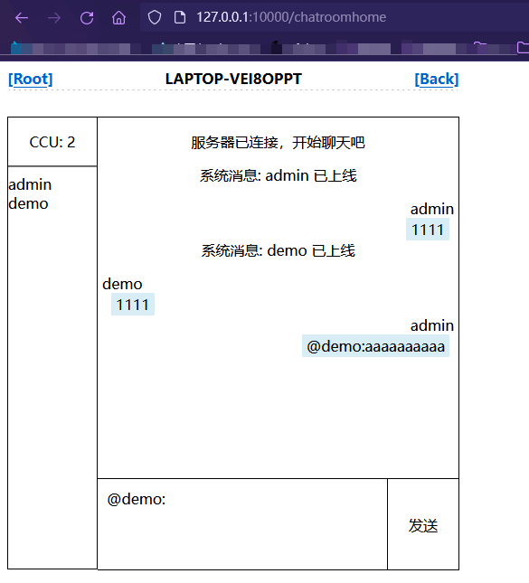

# 壹 介绍

有的时候，我们需要在内网环境中传输东西、或者是聊天、或者是做协议探测。例如之前有一次在客户现场，要传东西，然后都没有`U`盘，当时就写了一个简单的`demo`服务器工具，后来想想要不要做一个各种协议或者服务都能探测的服务端，所以就写了这个工具的雏形，后来发现`github`上已经有了一个非常优秀的`http`文件服务工具@https://github.com/TheWaWaR/simple-http-server，引用了其界面（确实很简约且好看），然后自己又加了一个聊天室。

# 贰 使用

- 编译

```bash
# windows
go env -w GOOS=windows
go build -o server_Tool_winodws_amd64.exe -ldflags="-s -w" -trimpath  .
# linux
go env -w GOOS=linux
go build -o server_Tool_linux_amd64 -ldflags="-s -w" -trimpath  .
# macOS
go env -w GOOS=darwin
go build -o server_Tool_darwin_amd64 -ldflags="-s -w" -trimpath  .
```


- help：


- `-au`是设置在服务运行时防止其他人未授权操作设置的，当然也可以不设置
- `-m`是选择服务协议，`ftp`目前比较拉跨，后面在改进
- `-ul`是设置`http`服务中的聊天室的用户列表，当然也可以不设置，聊天功能可用通过`@xxx:`来指定用户就行私聊，也可以通过`@xxx,yyy:`来私聊多个用户，例如：



# 叁 更新

v1.1.0：凑合着用吧！！！主要是每次改东西都忘记备份。。。